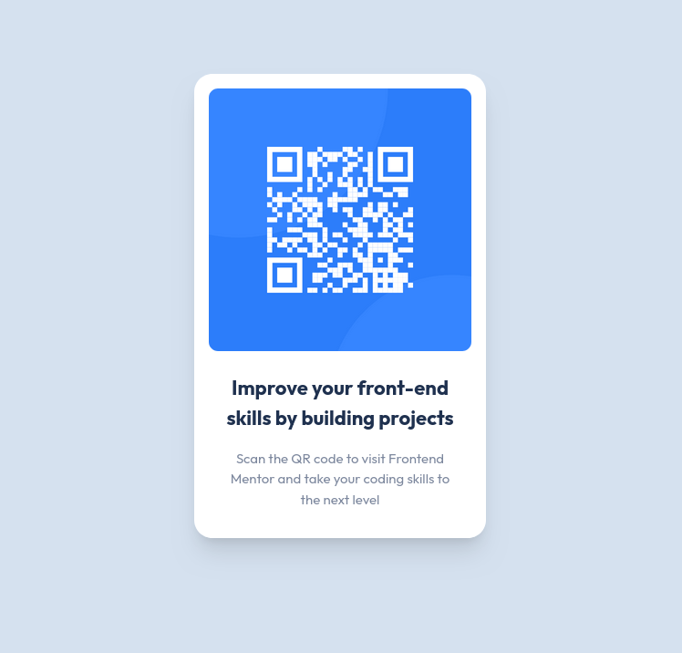

# Frontend Mentor - QR code component solution

This is a solution to the [QR code component challenge on Frontend Mentor](https://www.frontendmentor.io/challenges/qr-code-component-iux_sIO_H). Frontend Mentor challenges help you improve your coding skills by building realistic projects.

## Table of contents

- [Overview](#overview)
  - [Screenshot](#screenshot)
  - [Links](#links)
- [My process](#my-process)
  - [Built with](#built-with)
- [Author](#author)

## Overview

### Screenshot

### Links

- [Repo](https://github.com/ffrosch/frontendmentor-qr-code-component)
- [Live Site](https://ffrosch.github.io/frontendmentor-qr-code-component/)

## My process

### Built with

- Semantic HTML5 markup
- CSS custom properties
- CSS Grid
- Mobile-first workflow
- [React](https://reactjs.org/)
- [Tailwind CSS](https://tailwindcss.com/)
- [BEM methodology](https://getbem.com/)

## Author

- Website - [florianfrosch.de](https://florianfrosch.de/)
- Frontend Mentor - [@ffrosch](https://www.frontendmentor.io/profile/ffrosch)
